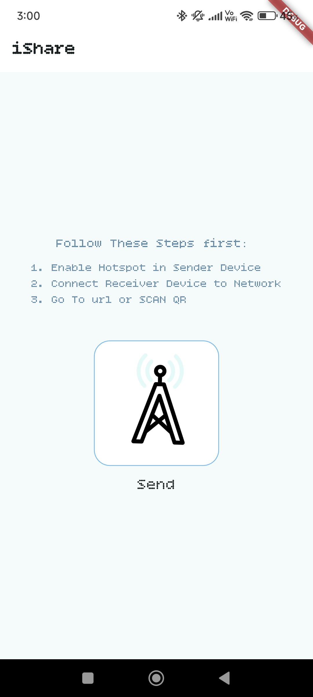
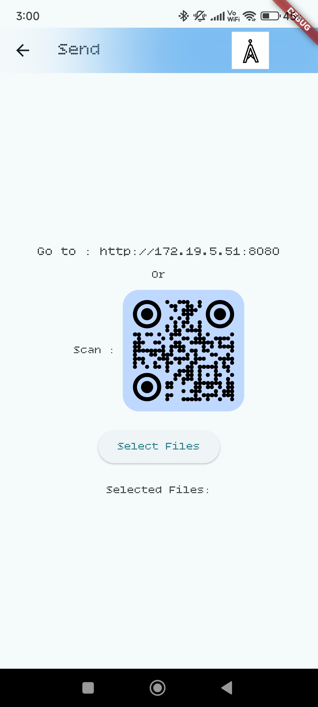
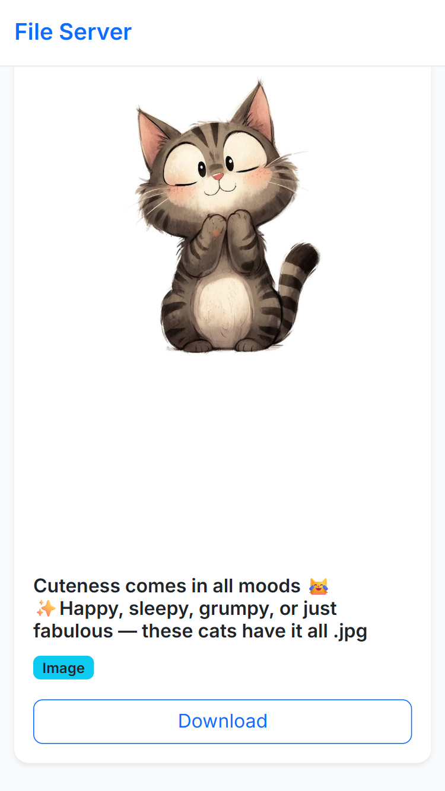
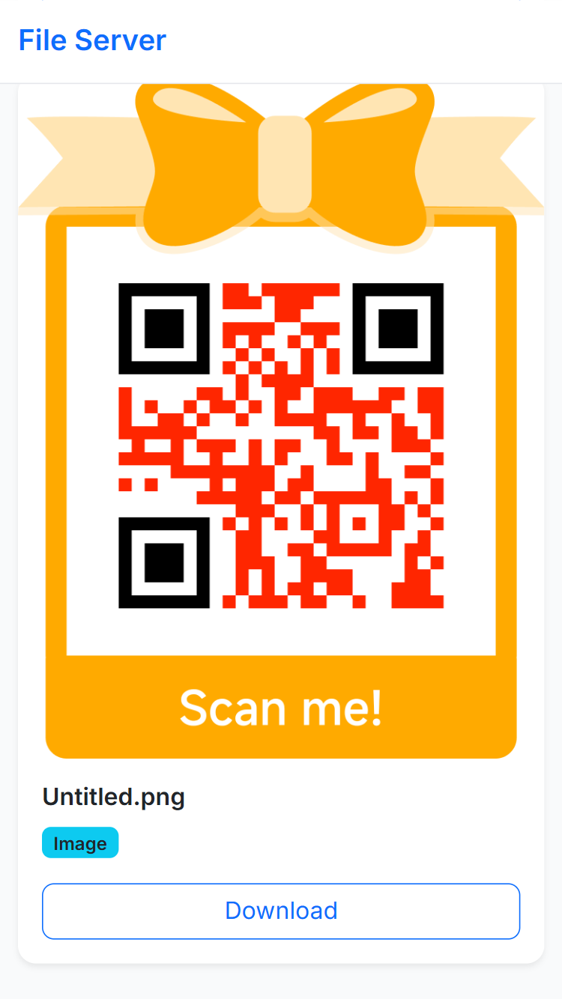
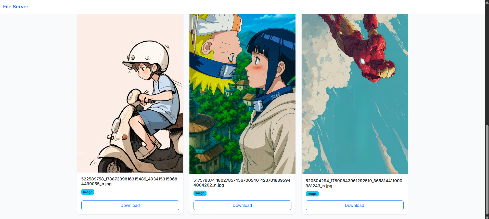

# 📲 iShare – Fast & Seamless File Sharing ⚡

Welcome to **iShare**, a Flutter app that makes **sharing files** between devices fast, reliable and simple. From sending media, documents, and more — iShare gives you intuitive UI and smooth performance.

| Home Screen | Send Screen | Receiver Screen | QR Screen | Computer Screen |
|-------------|-------------|-----------------|-----------|-----------------|
|  |  |  |  |  |

---

## 📥 Download the App

Try out iShare now!  
Click below to download the latest release:

[](https://drive.google.com/file/d/1gYu3bLGlLzKXSwzEm8ym-3I3HN7LDkN-/view?usp=sharing)

---

## 🚀 Features

- 📤 **Send Files Quickly**  
  Share images, documents, videos with just a few taps.

- 📥 **Receive Files Smoothly**  
  Device-to-device transfers; minimal waiting time, clear progress feedback.

- 🎨 **Clean & Minimal UI**  
  Focused on usability; easy to navigate even for first-time users.

- 🔒 **Secure Local Transfers**  
  Files are shared locally (no cloud upload unless user adds one); you always control the destination.

*(Add more features here if your app has: support for multiple files at once; notifications; history / saved transfers; settings; dark mode; etc.)*

---

## 🛠️ Tech Stack

| Component | Detail |
|-----------|--------|
| **UI** | Flutter, Dart |
| **State Management** | *(e.g. Provider / Bloc / Riverpod — replace with what you used)* |
| **File / Transfer Logic** | *(e.g. using sockets / local network / platform channels / share_plus etc.)* |
| **Asset Management** | Launcher icons, image assets in `assets/` folder |
| **Platforms Supported** | Android, iOS, (web / desktop if applicable) |

---

## 🧑‍💻 Getting Started

To run this project locally:

1. Clone the repository  
   ```bash
   git clone https://github.com/Ankit5125/iShare.git
   cd iShare
   flutter pub get
   flutter run
